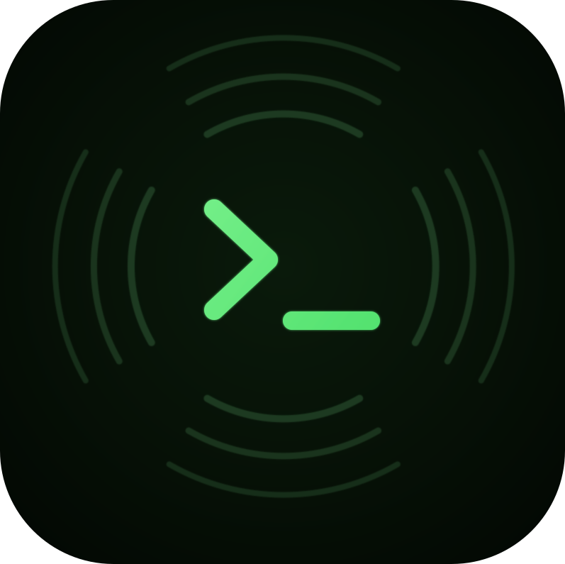
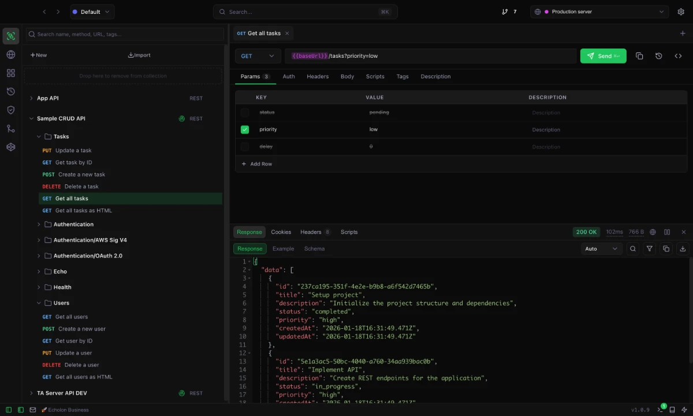

<p align="center">
     
</p>


# Echolon

[](https://github.com/echolon-app/echolon/releases)
[](LICENSE)
[](https://echolon.app)
[](https://echolon.app/download)

A powerful, git-native and local-first API client built with Electron and React.

<p align="center">
     
</p>


## Features

- **Collections & Requests**: Organize your API requests in collections and folders
- **Environment Variables**: Manage different environments with variables
- **Request Builder**: Full-featured request builder with params, headers, body, auth
- **Response Viewer**: View responses with syntax highlighting and search
- **API Mocking**: Advanced API mocking features (cloud + local)
- **History**: Track all your request history
- **Imports**: Import OpenAPI/Swagger or Postman files
- **cURL Export**: Export requests as cURL commands
- **Dark/Light Mode**: Beautiful themes for any preference
- **Completely Local**: All data stored locally, no account required
- **Git Client**: Integrated Git Client to share workspaces/collections with your team

## Commercial

Echolon is a open source project. There is a paid version if you want to support the future development.
It offers features that are required on a larger scale but 95% of its features are completely.
The commercial usage applies to the binaries downloaded from Github or echolon.app.
If you want to build the project yourself it is 100% free.

## Helpful Links

- Website: [echolon.app](https://echolon.app)
- Download: [echolon.app/download](https://echolon.app/download)
- Pricing: [echolon.app/pricing](https://echolon.app/pricing)
- Docs: [docs.echolon.app](https://docs.echolon.app)
- Support: support@echolon.app
- Sample API: [sample-api.echolon.app](https://sample-api.echolon.app)

## Development

### Repo structure

- core -> Echolon electron app
- docs -> astro based documentation
- sample-api -> Echolon sample api 
- web -> Echolon web version

### Prerequisites

- Node.js 18+
- npm or yarn

### Setup

```bash
cd core
# Install dependencies
npm install

# Start development server
npm run dev
```

### Building

```bash
cd core
# Build for all platforms
npm run package:all

# Build for specific platform
npm run package:mac
npm run package:win
npm run package:linux
```

### Release Electron for (Mac, Windows and Linux)

```bash
cd core
npm run release:all 
```

### Release for web
```bash
cd web
npm run deploy 
npm run deploy:lib
```

### Code Signing (Optional)

For macOS code signing, set these environment variables:

```bash
CSC_LINK=/path/to/certificate.p12
CSC_KEY_PASSWORD=certificate_password
APPLE_ID=your@email.com
APPLE_APP_SPECIFIC_PASSWORD=xxxx-xxxx-xxxx-xxxx
APPLE_TEAM_ID=XXXXXXXXXX
```

For Windows code signing (optional, without you get a warning on install):

```bash
CSC_LINK=/path/to/certificate.pfx
CSC_KEY_PASSWORD=certificate_password
```

For linux builds:
```bash
brew install rpm  
```

## Tech Stack

- **Electron** - Cross-platform desktop app
- **React 18** - UI framework
- **TypeScript** - Type safety
- **Vite** - Fast bundler
- **Ace Editor** - Code/JSON viewer


## License

MIT

